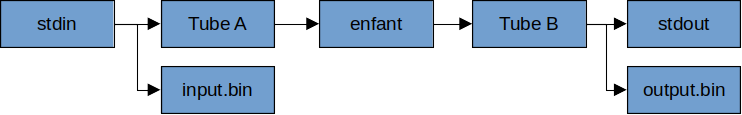

# INF3173-233-TP3 - Interception des entrées/sorties

Dans ce travail pratique, vous devez réaliser le programme `interceptor` permettant d'enregistrer l'entrée et la sortie standard d'une commande dans un fichier. Par exemple, on peut enregister l'interaction avec un programme, puis ensuite automatiser l'exécution.

Voici un exemple concret. Le jeu de devinette `jeu/Devinette.java` est fourni, dans lequel il faut deviner un nombre caché entre 0 et 100. Il s'agit d'un programme inspiré du cours d'introduction à la programmation INF1120.


```
# ajouter le programme interceptor dans le PATH
source build/env.sh

# Démarrage du jeu sans enregistrement
cd jeu
java Devinette.java

# Démarrage du jeu avec enregistrement
interceptor java Devinette.java

# Le fichier stdin.bin contiendra les saisies au clavier

# On peut rejouer automatiquement en fournissant ce fichier
java Devinette.java < input.bin
```

Le programme `interceptor` réalise la structure démontrée dans le schéma suivant. On commence par créer deux tubes, A et B, pour communiquer avec l'enfant. On crée un processus enfant, puis on remplace l'entrée standard par le tube A et la sortie standard par le tube B, puis on exécute le programme à monitorer. Par la suite, on exécute une boucle de transfert dans le processus parent, qui consiste à lire l'entrée standard (stdin) et le copier deux fois, soit une fois dans le tube A et une autre fois dans le fichier de journal `input.bin`. Similairement, le parent lit la sortie de l'enfant depuis le tube B et copie deux fois ces données, soit une fois sur la sortie standard (stdout) et une fois dans le fichier de journal `output.bin`.




Implémentez votre solution dans la fonction `interceptor_execute()` du fichier `interceptor.c`. Les arguments de la commande sont déjà traités pour vous. Voici la marche à suivre:

* Créer les deux tubes A et B avec l'appel système `pipe()`
* Créer un processus enfant avec `fork()`
* Dans l'enfant:
    * Remplacer l'entrée standard par le tube A et la sortie standard par le tube B avec l'appel système `dup2()`.
    * Porter attention à fermer les descripteurs de fichiers non-utilisés, sinon le programme pourrait attendre des données qui ne viendront jamais.
    * Exécuter la commande passée en argument avec `execvp()`.
* Dans le parent:
    * On ferme les descripteurs non-utilisés des tubes.
    * On ouvre les fichiers journaux
    * On réalise la boucle de transfert principale avec `select()`. Les descripteurs prêts à lire sont identifiés.
    * On sait que l'on ne recevra plus rien sur stdin si lire le descripteur retourne la valeur 0. Dans ce cas, il faut fermer le tube A, ce qui indique à l'enfant qu'il ne recevra plus de données.
    * Si lire le tube B retourne 0, alors on sait que l'enfant a terminé de produire des données et on peut fermer le tube B.
    * Quand tous les descripteurs sont fermés, alors on termine la boucle de transfer.
    * On lit le code de retour de l'enfant avec `waitpid()`.
    * On ferme les fichier de journaux.

Il faut porter attention aux blocages, car plusieurs situations peuvent produire un interblocage. Par exemple, bloquer en attente de lire la sortie de l'enfant causera un interblocage, si cela empêche de copier l'entrée vers l'enfant. L'utilisation de `select()` pour déterminer quels descripteurs sont prêt pour la lecture prévient ce problème.

Aussi, le programme principal ne doit PAS écrire de message sur la sortie standard, sinon les messages du programme `interceptor` seront mélangés avec la sortie de l'enfant. Pour cela, il suffit d'écrire tous les messages sur la sortie d'erreur, par exemple avec `fprintf(stderr, ...)`. On peut filtrer ou jeter ces messages avec la redirection de la sortie d'erreur:

```
# envoyer la sortie d'erreur (2) vers le néant ou un autre fichier
interceptor hexdump < data/ipsum.txt 2>/dev/null
```

Pour faciliter la manipulation de l'ensemble de descripteur de fichier `fd_set`, des fonctions sont mises à votre disposition (voir le fichier `fdset.h`). L'utilisation de ces fonctions est facultative.

Deux tests sont fournis. Ils exécutent le programme et comparent les fichiers. Consultez le fichier `test_interceptor.cpp` pour prendre connaissance des tests.

* Test Ipsum: exécution de hexdump sur un petit fichier texte. Le fichier texte est passé par l'entrée standard, donc il est attendu que le contenu du journal et le fichier de ipsum.txt soient identiques.
* Test Slomo: la commande slomo fait seulement une copie de l'entrée vers la sortie. Par contre, on introduit un délai, ce qui fait en sorte de révéler un interblocage potentiel.


Votre travail sera corrigé sur le système [Hopper](https://hopper.info.uqam.ca). Le système vous permet de former votre équipe pour ce TP. Faire l'archive avec `make dist`, puis envoyer l'archive sur le serveur de correction. Votre note sera attribuée automatiquement. Vous pouvez soumettre votre travail plusieurs fois et la meilleure note sera conservée. D'autres détails et instructions pour l'utilisation de ce système seront fournis.

Barème de correction

 * Test Ipsum: 50
 * Test Slomo: 50
 * Qualité du code (fuite mémoire, gestion d'erreur, etc): pénalité jusqu'à 10 points
 * Total sur 100 points

Le non-respect de la mise en situation pourrait faire en sorte que des tests échouent. Il est inutile de modifier les tests pour les faire passer artificiellement, car un jeu de test privé est utilisé.

Bon travail!
